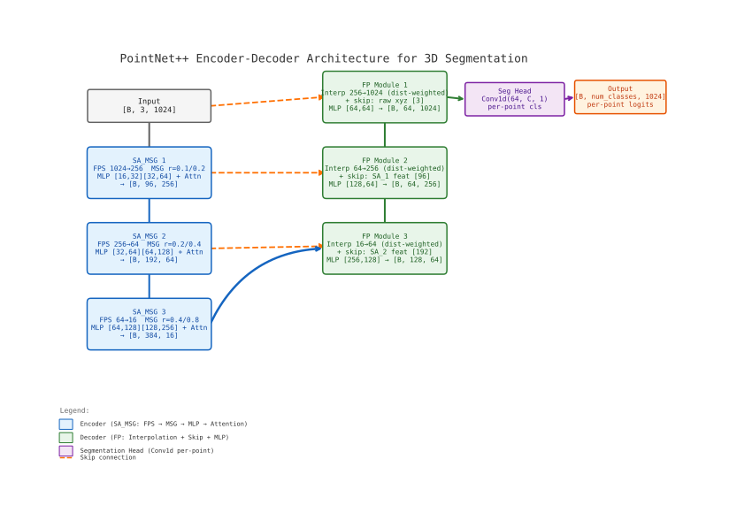

# PointNet++ for 3D Point Cloud Segmentation

Encoder-decoder PointNet++ with multi-scale grouping and attention for 3D point cloud part segmentation. Supports ShapeNetPart (50 classes) and custom KFS binary segmentation, with an end-to-end toolchain from data acquisition to deployment.

## Pipeline

```
┌──────────────────────────────────────────────────────────┐
│                   Data Acquisition                        │
│                                                          │
│  RealSense D435 + YOLO-seg (auto)    PCD 文件 (manual)   │
│  └─ tools/main.py ──────────────┐    └─ prepare_data.py  │
│                                  ▼                       │
│                    .npy [X, Y, Z, R, G, B, label]        │
├──────────────────────────────────────────────────────────┤
│                   Data Preprocessing                     │
│                                                          │
│  ┌─ src/data/ ────────────────────────────────────────┐  │
│  │  transforms.py: random sampling, normalization      │  │
│  │  dataset.py:  load .npy, __getitem__ → (pts, label) │  │
│  └─────────────────────────────────────────────────────┘  │
├──────────────────────────────────────────────────────────┤
│                   Model (PointNet++ MSG + Attention)     │
│                                                          │
│  ┌─ src/ ────────────────────────────────────────────┐  │
│  │  ops/     SA/FP layers + PointAttention            │  │
│  │  models/  pointnet2_seg.py / pointnet2_cls.py      │  │
│  │                                                    │  │
│  │  Encoder: 1024 → 256 → 64 → 16 pts (×3 SA_MSG)    │  │
│  │  Decoder: 16 → 64 → 256 → 1024 pts (×3 FP)        │  │
│  │  Head:    Conv1d → per-point logits               │  │
│  └─────────────────────────────────────────────────────┘  │
├──────────────────────────────────────────────────────────┤
│                   Training & Evaluation                   │
│                                                          │
│  scripts/train.py     → train on ShapeNetPart / KFS     │
│  scripts/evaluate.py  → mIoU / accuracy on test set     │
│  scripts/inference.py → single point cloud prediction   │
│  scripts/export.py    → TorchScript / ONNX export       │
└──────────────────────────────────────────────────────────┘
```

## Project Structure

```
├── config/
│   └── default.py              # 训练超参 + 路径 (dataclass)
├── src/
│   ├── ops/
│   │   ├── pointnet2_ops.py    # SA / FP / PointAttention
│   ├── models/
│   │   ├── pointnet2_seg.py    # 语义分割模型
│   │   └── pointnet2_cls.py    # 分类模型
│   ├── data/
│   │   ├── dataset.py          # ShapeNetPart / KFS 数据集
│   │   └── transforms.py       # 随机采样、归一化
│   └── utils/
│       ├── metrics.py          # mIoU、Acc 计算
│       └── visualize.py        # 点云可视化
├── scripts/
│   ├── train.py                # 训练入口
│   ├── evaluate.py             # 评估入口
│   ├── inference.py            # 单文件推理
│   ├── export.py               # TorchScript / ONNX 导出
│   └── prepare_data.py         # PCD → npy + Open3D 手动标注
├── tools/
│   ├── main.py                 # RealSense + YOLO-seg 自动采集
│   ├── config/default.yaml     # 采集配置
│   └── core/
│       ├── realsense.py        # RealSense 相机管理
│       ├── segmenter.py        # YOLO-seg 推理封装
│       └── pointcloud.py       # 深度→3D 投影 + label 融合
├── tests/                      # 核心算子单元测试
├── checkpoints/                # 训练权重
├── data/
│   ├── hdf5_data/              # ShapeNetPart HDF5
│   ├── raw/                    # 原始 PCD 文件
│   └── processed/              # 处理后 .npy
├── outputs/                    # 导出模型 (.ts, .onnx)
├── logs/                       # TensorBoard 日志
├── requirements.txt
└── setup.py                    # pip install -e .
```

## Installation

```bash
pip install -e .

# 手动标注需要 Open3D
pip install open3d

# 自动采集需要额外依赖
pip install -r tools/requirements.txt
# Intel RealSense SDK: https://github.com/IntelRealSense/librealsense
```

## Data Pipeline

两种数据获取方式，产出格式一致：

### A. 自动采集 (RealSense + YOLO-seg)

RealSense 实时预览，按 `a` 一键采集带标签点云，YOLO-seg 自动分割 RGB 图像后将标签投影到 3D 点云上。

```bash
# 连接 RealSense 相机后运行
python tools/main.py
# 可选参数: --conf 0.6 --save-dir /path
```

输出: `output/labeled/npy/labeled_{ts}.npy` — (N, 7) `[X, Y, Z, R, G, B, label]`

| 按键 | 功能 |
|------|------|
| `a` | 采集 → YOLO 分割 → 保存带标签点云 |
| `q` / `ESC` | 退出 |

> 采集的点云可直接用于训练，**无需二次标注**。

### B. 手动采集 (PCD → Open3D 标注)

```bash
# 1. PCD → npy 转换（含 RGB）
python scripts/prepare_data.py --pcd_dir data/raw --out_dir data/processed

# 2. Open3D 交互式标注（Ctrl+点击选择 KFS 点）
python scripts/prepare_data.py --label

# 3. 查看数据集统计
python scripts/prepare_data.py --inspect
```

### 输出格式

所有的 `.npy` 文件统一格式：

| 字段 | 列 | 类型 | 说明 |
|------|-----|------|------|
| X | 0 | float32 | 空间坐标 |
| Y | 1 | float32 | |
| Z | 2 | float32 | |
| R | 3 | uint8 | RGB 颜色 |
| G | 4 | uint8 | |
| B | 5 | uint8 | |
| label | 6 | int64 | 0=背景, 1=KFS |

## Configuration

### 训练配置 (`config/default.py`)

```python
@dataclass
class TrainConfig:
    num_classes: int = 50        # ShapeNetPart: 50 parts
    num_points: int = 1024       # 每样本点数
    batch_size: int = 16
    epochs: int = 50
    lr: float = 0.001
    device: str = "cuda" | "cpu"  # 自动检测

@dataclass
class KFSConfig(TrainConfig):
    num_classes: int = 2         # 二分类 (bg + KFS)
    num_points: int = 4096
    epochs: int = 100
```

### 采集配置 (`tools/config/default.yaml`)

```yaml
realsense:
  depth_min: 0.4    # 最小有效深度 (m)
  depth_max: 4.0    # 最大有效深度 (m)
yolo:
  conf: 0.5         # 检测置信度阈值
  kfs_classes: [0,1]# 哪些 YOLO 类别映射为 KFS
```

## Training

```bash
# ShapeNetPart (默认)
python scripts/train.py

# 自定义 KFS 数据集
python scripts/train.py --kfs

# 从检查点恢复
python scripts/train.py --resume checkpoints/epoch_50.pth
```

TensorBoard: `tensorboard --logdir logs`

## Evaluation

```bash
python scripts/evaluate.py
python scripts/evaluate.py --checkpoint checkpoints/best.pth
```

## Inference

```bash
python scripts/inference.py --input data/processed/sample.npy
python scripts/inference.py --input data/processed/sample.npy --visualize
```

## Export

```bash
# TorchScript
python scripts/export.py --format torchscript

# ONNX
python scripts/export.py --format onnx
```

## Architecture



- **Set Abstraction (MSG)**: FPS 降采样 + 多尺度 Ball Query + PointAttention 聚合局部特征
- **Feature Propagation**: 距离加权插值 + 跳跃连接 + MLP 上采样
- **Attention**: 在每组 SA 内部用自注意力增强局部特征表达

可编辑版本: `pointnetpp_architecture.xml`（[Draw.io](https://app.diagrams.net) 打开），重新生成: `python gen_diagram.py`

## Tests

```bash
pytest tests/
```
